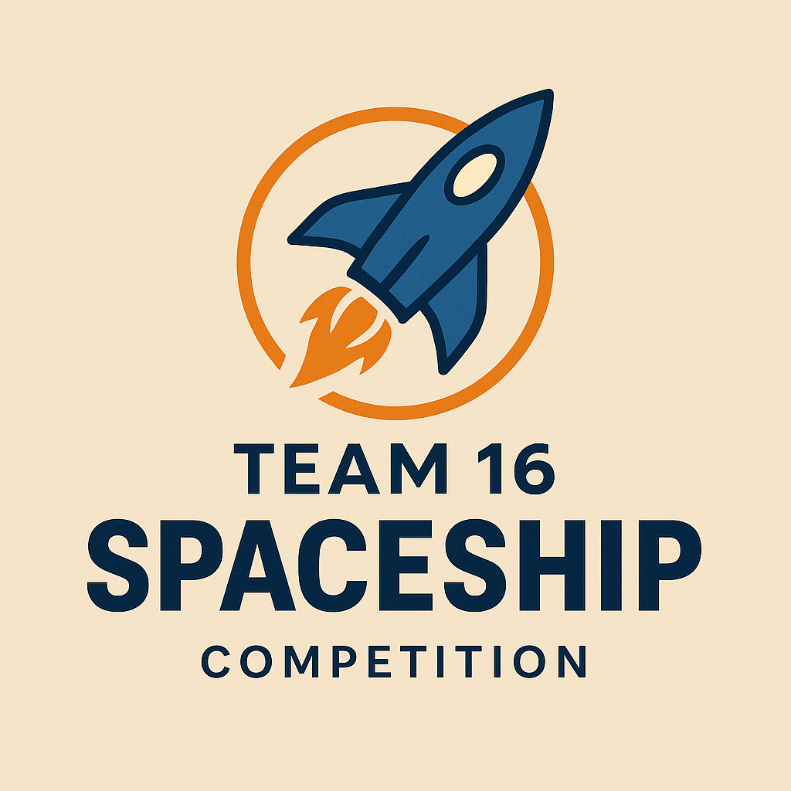

<p align="center">
  
</p>

#  Spaceship Titanic Kaggle Challenge

A Machine Learning solution for the Spaceship Titanic competition.

---

##  Google Colab Link

[](https://colab.research.google.com/github/spaceship-titanic-Zahoor-Khan-Team-16/spaceship-titanic-kaggle-challenge/blob/main/Group_16_Work%20updated.ipynb)

---

##  Repository Structure
- `Group_16_Work updated.ipynb`: Main Jupyter Notebook
- `train.csv`, `test.csv`: Dataset files
- `logo.png`: Team logo
- `README.md`: Project documentation


## Project Overview
This project is a solution for the Kaggle Spaceship Titanic competition (2022), where the goal is to predict which passengers were transported to an alternate dimension during a mysterious interstellar disaster. The problem is a binary classification task, evaluated using accuracy on a held-out test set.

- **Competition URL:** [Kaggle Spaceship Titanic](https://www.kaggle.com/competitions/spaceship-titanic)
- **Target Variable:** `Transported` (True/False)
- **Evaluation Metric:** Accuracy

## Team Information
| # | Name           | Student ID | Role                                 |
|---|----------------|------------|--------------------------------------|
| 1 | Zahoor Jan     | 22082448   | Group Leader & Model Evaluation      |
| 2 | SAIKIRAN PALLA | 22080111   | Data Analysis Lead                   |
| 3 | Momina Hammad  | 22047438   | Visualization & EDA                  |
| 4 | Abeeha Zafar   | 22095071   | Visualization & EDA                  |
| 5 | Shaista Rifaq  | 22046159   | Code Documentation                   |
| 6 | Jamal          | 22095206   | Feature Engineering                  |
| 7 | Golla Manasa   | 22101213   | Presentation Lead                    |
| 8 | Mohsin Zameer  | 22084592   | Collaborative & Project Management   |

**Team Size:** 8 members

## Dataset Overview
- `train.csv`: Training data with features and target
- `test.csv`: Test data for submission (no target)
- `submission.csv`: Submission format

## Project Structure & Methodology
The notebook is organized into the following main steps:

### 1. Data Loading & Exploration
- Load `train.csv` and `test.csv` using pandas
- Initial exploration of missing values, data types, and distributions

### 2. Feature Engineering
- **Basic Feature Extraction:** Parsing and extracting information from columns like `Cabin`, `Name`, etc.
- **Spending & Luxury Features:** Creating features such as `LuxuryRatio`, `TotalSpending`, `WealthScore`, `PremiumDeckSpending`, etc.
- **Group & Family Dynamics:** Features like `GroupSize`, `FamilyTotalSpending`, `GroupCohesion`, `IsFamilyGroup`, etc.
- **Age & Deck Hierarchy Features:** Binning ages, extracting deck levels, and more
- **Advanced Interaction Features:** Combining features to capture complex relationships
- **Final Feature Selection:** Two sets prepared: a high-value feature set (24 features) and a full feature set (61 features)

### 3. Model Training & Selection
- **Preprocessing:**
  - Label encoding for categorical variables
  - Median/mode imputation for missing values
- **Model Comparison:**
  - Trained and cross-validated five models: Random Forest, Logistic Regression, XGBoost, LightGBM, CatBoost
  - CatBoost achieved the highest cross-validation accuracy
- **Model Evaluation:**
  - Detailed metrics: Accuracy, Precision, Recall, F1-Score, ROC-AUC, PR-AUC
  - SHAP analysis for feature importance and model explainability
  - Ensemble model also evaluated, but CatBoost selected as best

### 4. Prediction & Submission
- Predictions generated on the test set using the best model
- Submission file created in the required Kaggle format

## Key Results
- **Best Model:** CatBoost Classifier
- **Cross-Validation Accuracy:** 0.7705
- **Training Accuracy:** 0.8463
- **Final Metrics (CatBoost):**
  - Accuracy: 0.80
  - Precision: 0.81
  - Recall: 0.79
  - F1-Score: 0.80
  - ROC-AUC: 0.86
  - PR-AUC: 0.85

## Technical Stack
- Python (pandas, numpy, scikit-learn, xgboost, lightgbm, catboost, matplotlib, seaborn, shap)
- Jupyter Notebook

## Usage Instructions
1. Install dependencies (see notebook for exact versions)
2. Run the notebook `Group_16_Work updated.ipynb` step by step
3. Place `train.csv` and `test.csv` in the working directory
4. The notebook will output predictions and a submission file

## Output Files
- `submission_updated.csv`: Final Kaggle submission file
- `catboost_training.json`: CatBoost training log/metrics

## Acknowledgements
- Kaggle for the competition and dataset
- All team members for their contributions

---
For any questions, please contact Zahoor Jan (Group Leader).


## GitHub ↔️ Colab Integration
This Colab notebook was opened **directly from GitHub**, and the repo is cloned into Colab using:

```python
!git clone https://github.com/spaceship-titanic-Zahoor-Khan-Team-16/spaceship-titanic-kaggle-challenge.git
